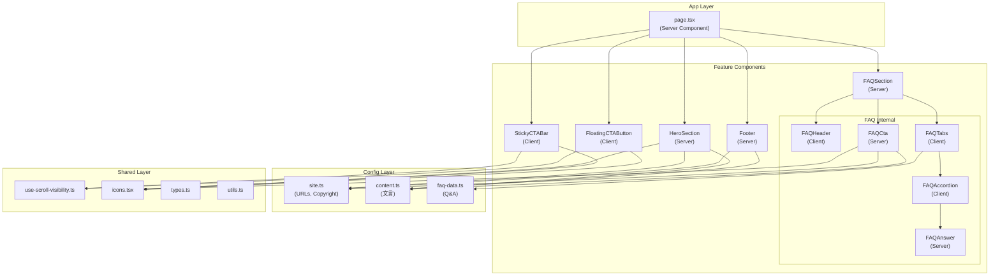
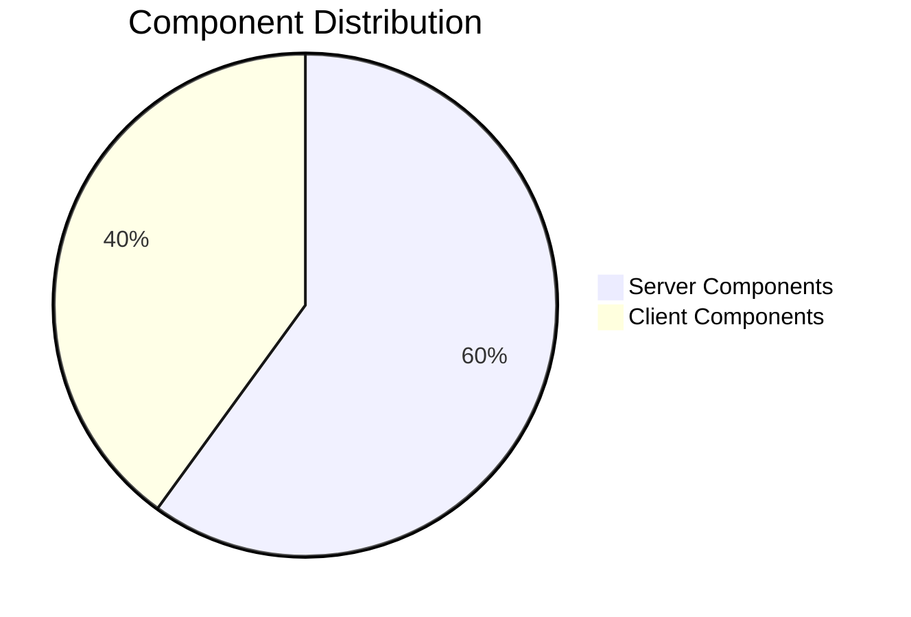

# TECH SPEC
## 技術仕様書 - 訪問看護 LP一体型FAQセクション

---

## I. Architecture Overview（アーキテクチャ概観）

### 1.1 技術スタック

| レイヤー | 技術 | バージョン | 選定理由 |
|---------|------|-----------|----------|
| Framework | Next.js (App Router) | 16.x | Server Componentsによるパフォーマンス最適化 |
| Language | TypeScript | 5.x | 型安全性、IDE補完、リファクタリング耐性 |
| Styling | Tailwind CSS | 4.x | ユーティリティファースト、カスタマイズ性 |
| Animation | Framer Motion | 11.x | 物理演算ベース、宣言的API |
| Icons | Lucide React | - | 軽量、Tree-shakable |
| UI Base | shadcn/ui | - | Headless、カスタマイズ可能 |
| Utilities | clsx + tailwind-merge | - | クラス名の競合解決 |

### 1.2 コンポーネントデータフロー



### 1.3 Server/Client Component 分離戦略



| Component | Type | 理由 |
|-----------|------|------|
| `page.tsx` | Server | 静的なレイアウト組み立てのみ |
| `HeroSection` | Server | 静的テキスト、アニメーションはCSS |
| `HeroStats` | Server | 静的データ表示 |
| `FAQSection` | Server | 外枠のみ |
| `FAQHeader` | **Client** | `whileInView`アニメーションに必要 |
| `FAQTabs` | **Client** | `useState`によるタブ切り替え |
| `FAQAccordion` | **Client** | `useState`による開閉状態管理 |
| `FAQAnswer` | Server | 静的テキスト表示 |
| `FAQCta` | Server | アニメーションはCSS（`cta-shake`） |
| `Footer` | Server | 完全に静的 |
| `StickyCTABar` | **Client** | スクロール検知、dismiss状態 |
| `FloatingCTAButton` | **Client** | スクロール検知、ホバー状態 |

---

## II. Directory Structure（ディレクトリ構造）

```
src/
├── app/                          # Next.js App Router
│   ├── page.tsx                  # メインページ（薄いレイヤー）
│   ├── layout.tsx                # ルートレイアウト
│   ├── globals.css               # グローバルスタイル
│   └── favicon.ico
│
├── components/
│   ├── features/                 # 機能別コンポーネント
│   │   ├── hero/
│   │   │   ├── index.ts          # バレルエクスポート
│   │   │   ├── hero-section.tsx  # メインコンポーネント
│   │   │   └── hero-stats.tsx    # 実績数値表示
│   │   │
│   │   ├── faq/
│   │   │   ├── index.ts
│   │   │   ├── faq-section.tsx   # セクション外枠（Server）
│   │   │   ├── faq-header.tsx    # ヘッダー（Client）
│   │   │   ├── faq-tabs.client.tsx      # タブUI（Client）
│   │   │   ├── faq-accordion.client.tsx # アコーディオン（Client）
│   │   │   ├── faq-answer.tsx    # 回答表示（Server）
│   │   │   ├── faq-cta.tsx       # CTA（Server）
│   │   │   └── faq-data.ts       # FAQデータ
│   │   │
│   │   └── cta/
│   │       ├── index.ts
│   │       ├── sticky-cta-bar.client.tsx    # モバイルCTA
│   │       └── floating-cta.client.tsx      # デスクトップCTA
│   │
│   ├── layouts/                  # レイアウトコンポーネント
│   │   ├── index.ts
│   │   └── footer.tsx
│   │
│   └── ui/                       # プリミティブUI
│       ├── accordion.tsx         # shadcn/ui
│       ├── button.tsx            # shadcn/ui
│       ├── tabs.tsx              # shadcn/ui
│       └── icons.tsx             # 共通SVGアイコン
│
├── config/                       # 設定・文言
│   ├── site.ts                   # サイト設定（URL, 著作権）
│   └── content.ts                # LP文言一元管理
│
├── hooks/                        # カスタムフック
│   └── use-scroll-visibility.ts  # スクロール表示制御
│
└── lib/                          # ユーティリティ
    ├── types.ts                  # 型定義
    └── utils.ts                  # cn()など
```

### 2.1 命名規則

| パターン | 例 | 意味 |
|---------|-----|------|
| `*.client.tsx` | `faq-tabs.client.tsx` | Client Component（明示的） |
| `*.tsx` (default) | `faq-section.tsx` | Server Component |
| `index.ts` | `features/faq/index.ts` | バレルエクスポート |
| `use-*.ts` | `use-scroll-visibility.ts` | カスタムフック |

---

## III. Component Anatomy（コンポーネント解剖）

### 3.1 FAQSection の構成

```
FAQSection (Server)
├── FAQHeader (Client)        # タイトル + アニメーション
├── FAQTabs (Client)          # タブUI + 状態管理
│   └── FAQAccordionList (Client)
│       └── FAQAccordionItem (Client)
│           └── FAQAnswer (Server)  # 回答テキスト表示
└── FAQCta (Server)           # 下部CTA
```

### 3.2 Props Flow

```typescript
// FAQTabs → FAQAccordionList
interface FAQAccordionListProps {
  items: FAQItem[];  // FAQデータ配列
  tabKey: string;    // 一意キー生成用
}

// FAQAccordionList → FAQAccordionItem
interface FAQAccordionItemProps {
  item: FAQItem;
  index: number;
  isOpen: boolean;
  onToggle: () => void;
}

// FAQAccordionItem → FAQAnswer
interface FAQAnswerProps {
  answer: string;  // マークダウン風テキスト
}
```

---

## IV. Styling Rules（スタイリング規則）

### 4.1 カラーパレット

```css
/* globals.css - :root */
--navy: #0f172a;        /* 信頼、プロフェッショナル */
--navy-light: #1e293b;  /* 背景バリエーション */
--navy-dark: #020617;   /* 深い背景 */
--gold: #d4af37;        /* 成功、権威、CTA */
--gold-light: #e5c453;  /* ホバー時 */
--gold-dark: #b8962e;   /* アクティブ時 */
```

### 4.2 使用ルール

| 用途 | 色 | Tailwind Class |
|------|-----|----------------|
| メインテキスト | Navy | `text-navy` |
| 背景（ダーク） | Navy | `bg-navy`, `bg-navy-light` |
| CTA ボタン | Gold Gradient | `bg-gradient-to-r from-gold to-gold-light` |
| アクセント | Gold | `text-gold`, `border-gold` |
| 補助テキスト | Slate | `text-slate-600`, `text-slate-400` |

### 4.3 スペーシング

```
Section Padding: py-16 md:py-24
Container Max-width: max-w-4xl (FAQ), max-w-5xl (Hero)
Card Padding: p-5
Gap (items): gap-4
```

### 4.4 アニメーション

| 名前 | 用途 | 設定 |
|------|------|------|
| `shimmer` | カードホバー | 1.5s ease-in-out infinite |
| `shake` | CTA注目 | 5s ease-in-out infinite（最後10%のみ動作） |
| `pulse-gold` | CTA脈動 | 2s ease-in-out infinite |
| Framer Motion | アコーディオン開閉 | duration: 0.3, ease: "easeInOut" |

### 4.5 レスポンシブブレークポイント

```
sm: 640px   - タブレット縦
md: 768px   - タブレット横/小型PC
lg: 1024px  - デスクトップ
```

| 要素 | モバイル | デスクトップ |
|------|---------|-------------|
| タイトル | text-3xl | md:text-4xl |
| 本文 | text-sm | md:text-base |
| CTA | py-4 px-8 | py-5 px-12 |
| Sticky CTA | 表示 | `md:hidden` |
| Floating CTA | `hidden` | `md:block` |

---

## V. State Management（状態管理）

### 5.1 ローカル状態のみ

このプロジェクトではグローバル状態管理（Redux, Zustand等）は**不要**。

理由：
- 状態がコンポーネント間で共有されない
- 各コンポーネントの状態は独立している

| 状態 | スコープ | 管理方法 |
|------|---------|----------|
| アクティブタブ | FAQTabs | `useState` |
| 開いているアコーディオン | FAQAccordionList | `useState` |
| スクロール表示 | 各CTA | カスタムフック |
| ホバー状態 | FloatingCTA | `useState` |
| 閉じた状態 | StickyCTA | カスタムフック |

### 5.2 カスタムフックパターン

```typescript
// 再利用可能なスクロール検知ロジック
export function useScrollVisibility(threshold: number) {
  const [isVisible, setIsVisible] = useState(false);
  
  useEffect(() => {
    const handleScroll = () => {
      setIsVisible(window.scrollY > threshold);
    };
    window.addEventListener("scroll", handleScroll, { passive: true });
    return () => window.removeEventListener("scroll", handleScroll);
  }, [threshold]);

  return isVisible;
}
```

---

## VI. Performance Optimization（パフォーマンス最適化）

### 6.1 Server Componentsの活用

```
Before: 全てClient Component → JSバンドル 100%
After:  Server/Client分離   → JSバンドル 約40%に削減
```

### 6.2 アニメーション最適化

| 手法 | 実装 |
|------|------|
| CSS-onlyアニメーション | `cta-shake`, `shimmer` |
| `will-change` | 必要な要素にのみ適用 |
| `passive: true` | スクロールイベントリスナー |

### 6.3 フォント最適化

```typescript
// layout.tsx - next/font による最適化
const notoSansJP = Noto_Sans_JP({
  subsets: ["latin"],
  weight: ["400", "500", "600", "700", "800"],
  display: "swap",  // FOUT対策
});
```

---

## VII. Testing Strategy（テスト戦略）

### 7.1 推奨テスト構成

```
tests/
├── unit/                    # ユニットテスト
│   ├── utils.test.ts        # cn()など
│   └── hooks.test.ts        # カスタムフック
├── component/               # コンポーネントテスト
│   ├── faq-accordion.test.tsx
│   └── faq-tabs.test.tsx
└── e2e/                     # E2Eテスト
    └── faq-flow.spec.ts     # ユーザーフロー
```

### 7.2 テスト観点

| 観点 | テスト内容 |
|------|----------|
| タブ切り替え | 正しいコンテンツが表示されるか |
| アコーディオン | 開閉状態が正しく切り替わるか |
| CTA リンク | 正しいURLに遷移するか |
| レスポンシブ | モバイル/デスクトップで正しいCTAが表示されるか |

---

## VIII. Deployment（デプロイ）

### 8.1 推奨環境

| 環境 | サービス | 理由 |
|------|---------|------|
| Hosting | Vercel | Next.js最適化、Edge Functions |
| CDN | Vercel Edge Network | 自動設定 |
| Analytics | Vercel Analytics / GA4 | パフォーマンス監視 |

### 8.2 環境変数

```env
# 将来的に必要になる可能性
NEXT_PUBLIC_GA_ID=G-XXXXXXXXXX
NEXT_PUBLIC_SITE_URL=https://example.com
```

### 8.3 ビルドコマンド

```bash
npm run build   # 本番ビルド
npm run start   # 本番サーバー起動
npm run lint    # ESLint実行
```

---

## IX. Troubleshooting（トラブルシューティング）

### 9.1 よくある問題

| 問題 | 原因 | 解決策 |
|------|------|--------|
| Hydration mismatch | Server/Client不一致 | `"use client"`の位置確認 |
| CSS未適用 | Tailwind v4構文 | `@theme`ブロック確認 |
| アニメーション動かない | クラス名typo | `cta-shake`などを確認 |

### 9.2 デバッグツール

```bash
# Next.js デバッグモード
NODE_OPTIONS='--inspect' npm run dev

# ビルド分析
ANALYZE=true npm run build
```

---

*このドキュメントは技術的な「How」を記録し、新規参画者のオンボーディングを加速させるために作成されました。*

